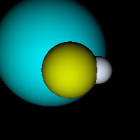
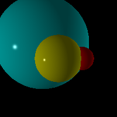
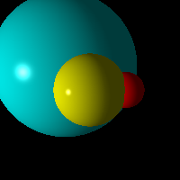
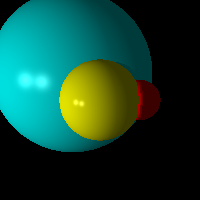
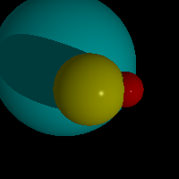
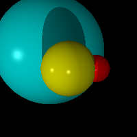
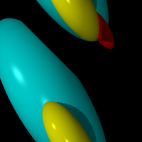

# Tracer
purely functional ray tracer in scala

### Overview
Implemented 

[__Compressive Sensing__](./cs.md)

0. Rendering
* Light
* Sphere modeling
* Polygon modeling
* interpreter for fast descriptive modeling
* interpolation with racket & common lisp
1. Shading
* lambertian shadingP
* blinn-phone shading
* ambient shading
* shadowing
* mirror reflection
2. Anti-Aliasing
* super sampling (SSAA)
* gupta midpoint
3. Functional!
* all codes written in functional style 
* (almost, ok I actually used one single variable to store time)

### Evolution

### Performance
* I used heavy list processing so generally for a 200 x 200 png file it takes 10 seconds on my machine(core i7, 8GB RAM) to finish rendering
